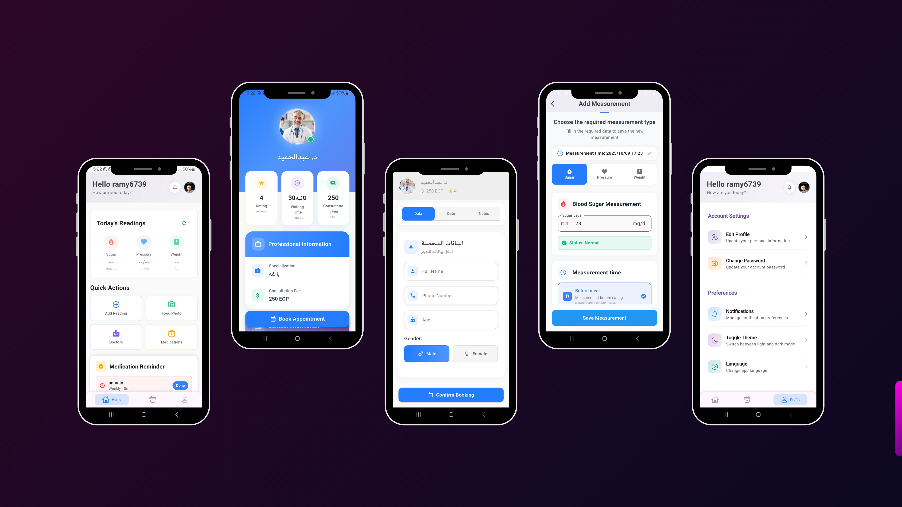

# Challenge Your Diabetic App 🩺🍎

**Challenge Your Diabetic** is a Flutter-based health management app for diabetic patients.  
It helps users track glucose, blood pressure, weight, manage medications, book doctors, and get AI-based food recommendations.

---

## 🚀 Features / المميزات

### 👨‍⚕️ Health Monitoring / متابعة الصحة
- 🩸 **Glucose Measurement / قياس السكر** – Track your blood sugar levels  
- 💓 **Blood Pressure / ضغط الدم** – Monitor BP regularly  
- ⚖️ **Weight Tracking / متابعة الوزن** – Add daily weight measurements  
- ⚠️ **Alerts / التحذيرات** – Notifications for high/low sugar or pressure  

### 🏥 Doctor & Appointments / حجز دكاترة
- 📅 **Doctor Booking / حجز دكاترة** – Schedule appointments with doctors  
- 👤 **Profile Management / بيانات شخصية** – View & edit personal information  

### 🤖 AI Recommendations / نظام ذكي
- 📸 **Food Recognition / تصوير الطعام** – AI analyzes your meals and tells you if it's suitable  
- 💊 **Medication Reminder / تذكير بالأدوية** – Set reminders for your medications  
- 🏃‍♂️ **Exercise & Health Tips / رياضة وفوائدها** – Browse recommended exercises  
- 📚 **Educational Content / قراءة عن الصحة** – Learn about healthy habits and benefits  

---

## 📸 App Preview

<p align="left">
  
</p>

---

## 📂 Download & Demo

- 📱 **APK Download**  
[Download APK](https://drive.google.com/file/d/1oGVjf7TefQNExTtQwuE-KxnAr-jap9DR/view?usp=drivesdk)

- 🎬 **Demo Video**  
[Watch Demo Video](https://drive.google.com/file/d/1DdwR92_YnzFSgl7GA8wNAz8OF04CzYz7/view?usp=drivesdk)

---

## 🛠️ Installation & Setup

```bash
# Clone the repository
git clone https://github.com/taha2901/challengeYourDiabetic.git

# Navigate to project folder
cd challenge-your-diabetic

# Install dependencies
flutter pub get

# Run the app
flutter run


